# Top 26 Food Delivery Services in 2025 (Comprehensive Review)

Ordering meals and groceries to your doorstep has shifted from occasional convenience to essential lifestyle infrastructure, whether you're craving restaurant takeout after a long workday, stocking your pantry without store trips, or discovering chef-designed recipes that arrive pre-portioned at your door. The platform you choose determines delivery speed, restaurant selection, subscription value, and whether you're cooking from scratch or heating pre-made meals in minutes.

This collection ranks 26 leading food delivery services and meal kit platforms based on comprehensive evaluation including delivery coverage, restaurant partnerships, pricing transparency, subscription benefits, and user satisfaction across different use cases from quick restaurant orders to weekly meal planning solutions. Each service addresses specific needs, from families seeking budget-friendly meal kits to busy professionals wanting prepared meals delivered fresh, never frozen.

***

## **[DoorDash](https://doordash.com)**

The largest food delivery network in America, connecting customers to 600,000+ restaurants, grocery stores, and retail partners across 7,000+ cities with industry-leading delivery infrastructure.

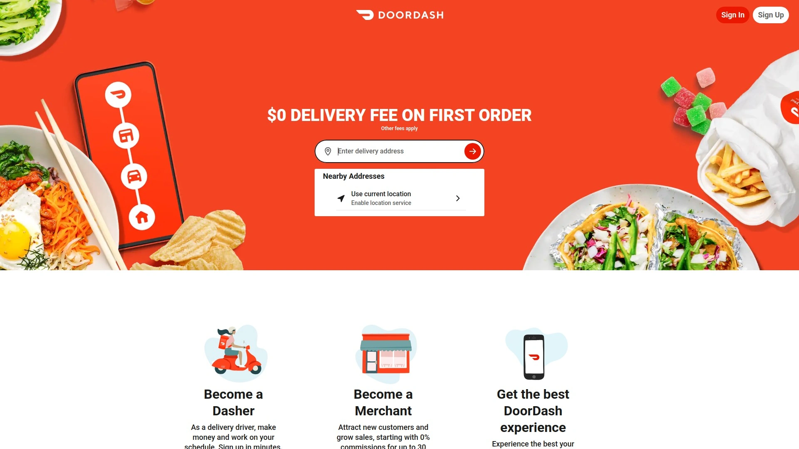

DoorDash dominates the U.S. meal delivery market with the broadest restaurant selection and most extensive delivery coverage, making it the default choice for accessing local dining options from national chains to neighborhood favorites. The platform expanded beyond restaurant delivery to include grocery fulfillment from nearly 2,700 Kroger stores nationwide starting October 2025, delivering full grocery assortments in as little as one hour.

**DashPass subscription transforms the economics** of frequent ordering by eliminating delivery fees on eligible orders over $12 and reducing service fees, typically paying for itself after three orders per month. Members access exclusive deals and priority support, creating substantial savings for regular users.

The 2025 platform enhancements introduce AI-powered recommendations that learn your preferences, creator videos showing actual menu items from local food influencers in cities like Atlanta and Miami, and smart tags filtering menus by dietary needs including vegetarian and high-protein options. Integration with Yelp brings trusted photos and reviews directly into the ordering experience.

Consumer research reveals that 52% of users feel comfortable with AI providing personalized restaurant recommendations, with millennials showing 60% acceptance rates. The platform serves this demand through machine learning that suggests meals based on order history and browsing patterns.

Restaurant discovery happens increasingly through social media, with most consumers reporting they've ordered viral food items seen on platforms like TikTok and Instagram. DoorDash capitalizes on this trend by featuring trending items and creator content prominently in the app.

Delivery speed and real-time tracking provide transparency from restaurant confirmation through courier arrival, with estimated times factoring in food prep, traffic conditions, and weather variables. The platform maintains contactless delivery as default while offering "hand it to me" options for those preferring direct handoff.

***

## **[Uber Eats](https://ubereats.com)**

Leveraging Uber's massive driver network for fast restaurant delivery with seamless integration across transportation and food services in one unified app experience.

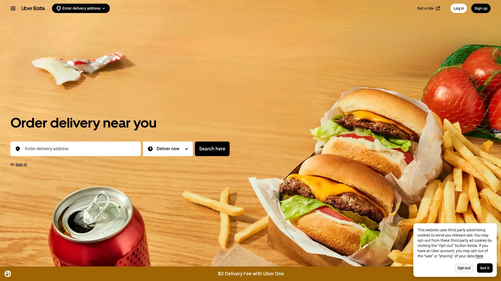

The platform benefits from Uber's established rideshare infrastructure, providing access to more delivery drivers during peak hours compared to delivery-only services. This network effect results in faster pickup and delivery times, especially in urban markets where driver density remains high.

Users appreciate the convenience of managing both transportation and food delivery through a single app with unified payment methods and rewards. The Uber One membership bundles benefits across services, offering value for customers who use both rideshare and food delivery regularly.

Restaurant selection spans from quick-service chains to upscale dining establishments, with particular strength in major metropolitan areas. The platform processes substantial transaction volume, capturing approximately 25% market share when combined with Postmates.

Delivery fees and service charges vary based on distance, restaurant partnership status, and demand timing. The platform's dynamic pricing adjusts rates during high-demand periods, which can increase total costs compared to competitors during peak hours.

Real-time order tracking shows courier location on a live map from restaurant pickup through final delivery. The interface provides estimated arrival windows that update based on actual progress rather than static predictions.

***

## **[Grubhub](https://grubhub.com)**

Veteran platform with extensive restaurant partnerships and personalized recommendations powered by machine learning algorithms that suggest meals based on ordering history.

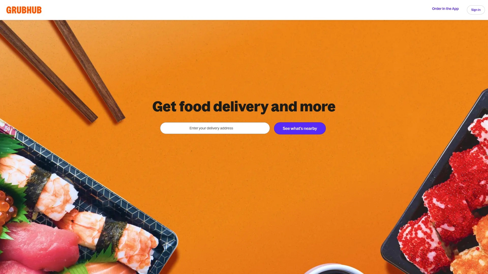

Founded as one of the earliest food delivery services, Grubhub maintains strong relationships with thousands of restaurants across diverse cuisines. The platform excels at surfacing relevant options through its recommendation engine that analyzes past orders to predict preferences.

**Grubhub+ subscription eliminates delivery fees** on orders meeting minimum thresholds while providing access to exclusive restaurant deals and discounts. The loyalty rewards program accumulates points with every purchase, redeemable for future order credits.

The interface prioritizes ease of use with straightforward navigation and filtering options for cuisine type, dietary restrictions, and delivery time. Users consistently rate the app highly for its intuitive design that makes restaurant browsing and ordering simple.

Delivery fee structures vary significantly based on restaurant location, order timing, and local demand. Some users note that fees can escalate during busy periods, making cost comparison worthwhile before placing orders.

Availability concentrates in major metropolitan areas with less coverage in smaller cities and rural regions compared to newer competitors that have expanded more aggressively. Prospective users should verify service availability in their specific location.

Customer support responsiveness receives mixed feedback, with some users experiencing longer resolution times for order issues compared to competitors. The platform continues working on improving support quality and response speed.

***

## **[Instacart](https://instacart.com)**

Leading grocery delivery platform partnering with major retailers nationwide, enabling same-day delivery from local supermarkets with personal shoppers selecting your items in-store.

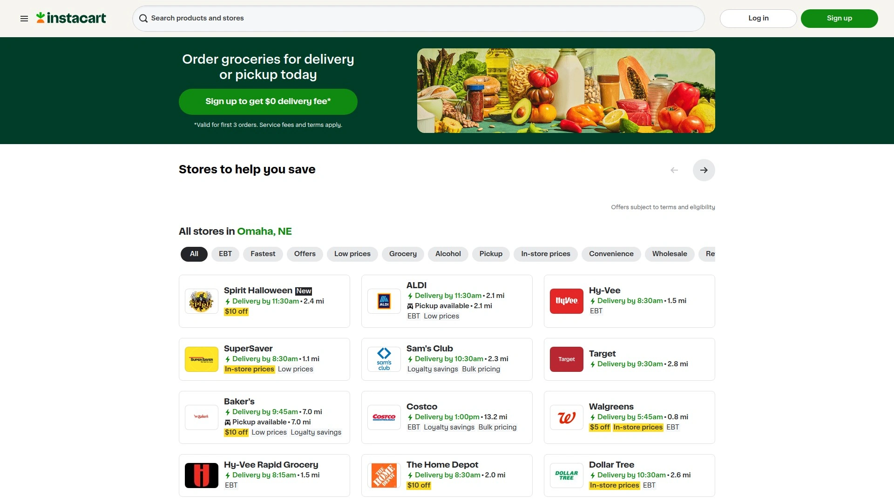

Instacart revolutionized grocery shopping by connecting customers to nearly every major supermarket chain including Kroger, Safeway, Costco, Publix, and specialty stores. The platform operates across all 50 U.S. states and Canada, offering the widest geographic coverage for grocery delivery.

Personal shoppers receive your list, navigate store aisles, and communicate in real-time about substitutions when items are unavailable. This human element ensures quality selection of produce, meat, and perishables according to your specifications.

**Delivery fees start at $3.99 for one-time orders**, making it affordable for occasional use without subscription commitment. The Express membership unlocks unlimited free delivery on orders over $35, typically worthwhile for weekly grocery shoppers.

Service fees apply to all orders as a percentage of the cart total, covering operational costs beyond delivery. Instacart also implements "Busy Pricing" during high-demand windows, adding extra charges when shopper availability is limited.

The platform charges slightly higher prices than in-store rates for most items, with markups varying by retailer partnership. This price difference covers the convenience and shopper service, though customers should factor it into budgeting.

Priority delivery upgrades reduce wait times to as little as one hour for an additional fee, useful when you need ingredients urgently. Standard delivery allows scheduling specific time slots throughout the day.

Integration with Sunbasket brings meal kit ordering directly through the Instacart app, expanding options beyond grocery staples. This creates a one-stop solution for both pantry stocking and planned meal ingredients.

***

## **[Shipt](https://shipt.com)**

Target-owned grocery delivery service emphasizing personal shopper relationships and real-time communication, with no minimum order requirements for maximum flexibility.

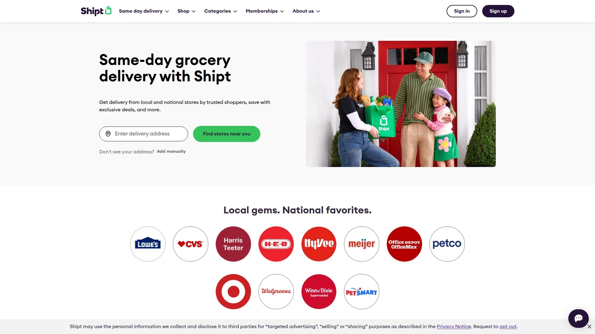

Shipt operates as Target's official delivery partner, offering in-store pricing and Target REDcard discounts when ordering through the Target app integration. This eliminates the price markups common with other delivery services, providing genuine savings for Target shoppers.

The platform delivers from Target, CVS, Kroger, HEB, Walgreens, Petco, and other major retailers depending on location. Availability varies by market, with larger cities typically offering more store partnerships.

**Personal approach distinguishes Shipt** through direct communication channels with shoppers who send photos, ask questions, and make substitution recommendations based on their experience. Many customers develop preferences for specific shoppers who understand their preferences.

Annual membership costs $99, providing unlimited same-day deliveries with no delivery fees on orders over $35. This pricing structure proves economical for regular users, effectively costing under $2 per week.

Smaller orders under $35 incur a $7 delivery fee, though no minimum order requirement exists. This flexibility accommodates mid-week necessity runs without forcing unnecessary purchases to reach thresholds.

Shipt avoids surge pricing, maintaining consistent delivery fees regardless of demand fluctuations. This predictability helps budget-conscious shoppers plan costs without surprise charges during busy periods.

Shopper vetting and training emphasizes quality selection, particularly for fresh produce, meats, and items with expiration dates. Users report better product quality compared to some competitors.

***

## **[HelloFresh](https://hellofresh.com)**

Global meal kit leader delivering pre-portioned ingredients and chef-designed recipes to your door, offering 50+ weekly menu options across multiple dietary preferences.

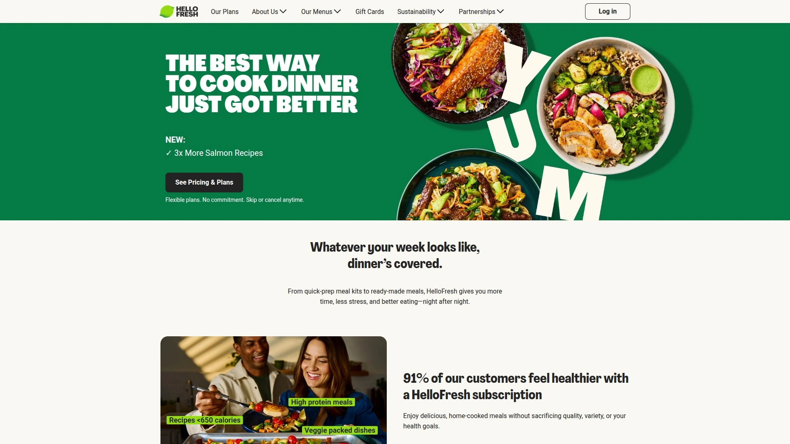

HelloFresh simplifies home cooking by eliminating meal planning, grocery shopping, and ingredient measuring. Each box contains exactly what you need for the selected recipes, reducing food waste from unused portions.

The rotating menu provides 50+ recipes weekly spanning categories including Family Friendly, Fit & Wholesome, Vegetarian, Pescatarian, and Quick & Easy preparations. This variety prevents menu fatigue while accommodating different household preferences.

**Pricing starts at $9.99 per serving** with costs decreasing based on the number of meals and servings ordered per week. Larger plans offer better per-meal economics for families.

Sturdy, insulated packaging arrives with meals organized in individual bags and proteins separated on ice packs. Delivery occurs seven days per week between 8 AM and 8 PM through Veho logistics, with tracking available via app or text confirmation.

Recipe cards provide step-by-step instructions with photos, estimated cooking times, and nutritional information. Most meals require 25-40 minutes of active cooking, making them accessible for weeknight preparation.

The platform works through Veho for delivery logistics, allowing customers to track boxes via confirmation texts or dedicated tracking apps. Deliveries maintain flexibility across the week.

Ingredient quality emphasizes fresh produce and responsibly sourced proteins, though some budget-conscious users may find comparable quality at grocery stores for less. The convenience premium pays for planning, shopping, and portioning labor.

***

## **[Factor](https://factor75.com)**

Chef-prepared, dietitian-approved ready-to-eat meals requiring just two minutes in the microwave, ideal for individuals prioritizing convenience over cooking.

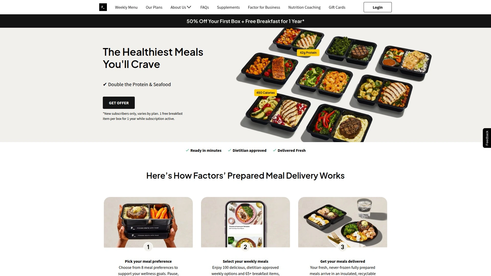

Factor eliminates all meal preparation by delivering fully cooked dishes that simply need reheating. This positions the service as the ultimate convenience option for people who want nutritious meals without touching a spatula.

The menu rotates 40+ meals weekly across dietary categories including keto-friendly, vegetarian, high-protein, low-calorie, and various international cuisines. This extensive selection prevents repetition and accommodates specific nutritional goals.

**Meals arrive fresh, never frozen**, designed to be consumed within seven days of delivery. The packaging uses thick insulation and large ice packs to maintain proper temperature during transit.

Pricing ranges from $11 to $14 per meal depending on the weekly order quantity, with larger subscriptions offering better per-meal rates. The service regularly runs promotional discounts for new subscribers.

Factor operates as a HelloFresh subsidiary, benefiting from the parent company's established supply chain and quality control systems. This infrastructure ensures consistent meal quality and reliable delivery.

Deliveries arrive on Monday, Tuesday, or Wednesday depending on location. The compact boxes fit easily in refrigerators, with meals stacked efficiently.

Add-ons expand beyond dinners to include breakfast items, snacks, smoothies, and juices for customers wanting comprehensive meal coverage. This allows building a full day's nutrition through a single service.

***

## **[Postmates](https://postmates.com)**

Multi-category delivery platform handling food, groceries, alcohol, and essentials with one-hour delivery in major cities for ultimate on-demand convenience.

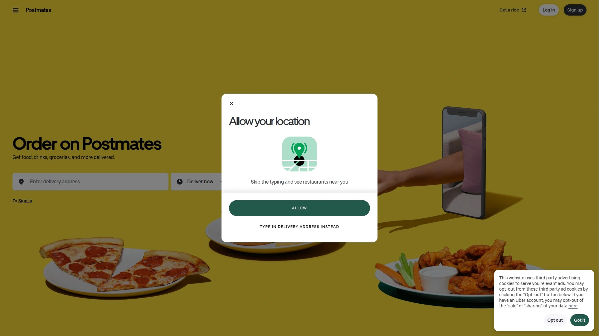

Postmates differentiates itself by delivering virtually anything available locally, from restaurant meals to pharmacy items to electronics. This versatility makes it a one-stop solution for various delivery needs.

The platform operates in major urban centers with particularly strong coverage in metropolitan areas. Delivery speed often reaches under one hour, especially for food and convenience items.

**Postmates Unlimited subscription removes delivery fees** and provides access to exclusive offers for subscribers who use the service frequently. The membership value proposition works best for multi-category users.

Integration with Uber following the acquisition means users can often access Postmates inventory through the Uber Eats app. This consolidation provides more options within a unified interface.

Delivery fees can escalate for small or low-cost items, sometimes making quick convenience purchases expensive relative to the item value. Users should consider minimum order strategies to optimize cost efficiency.

Rural and suburban availability remains limited compared to urban cores where the service concentrates its operations. Geographic expansion continues but focuses on high-density population centers.

App performance occasionally experiences slowdowns during extreme demand periods, though the platform continues improving infrastructure capacity. Most standard usage encounters no technical issues.

***

## **[Blue Apron](https://blueapron.com)**

Original meal kit pioneer offering sophisticated recipes with premium ingredients and diverse culinary templates from lettuce wraps to international cuisines.

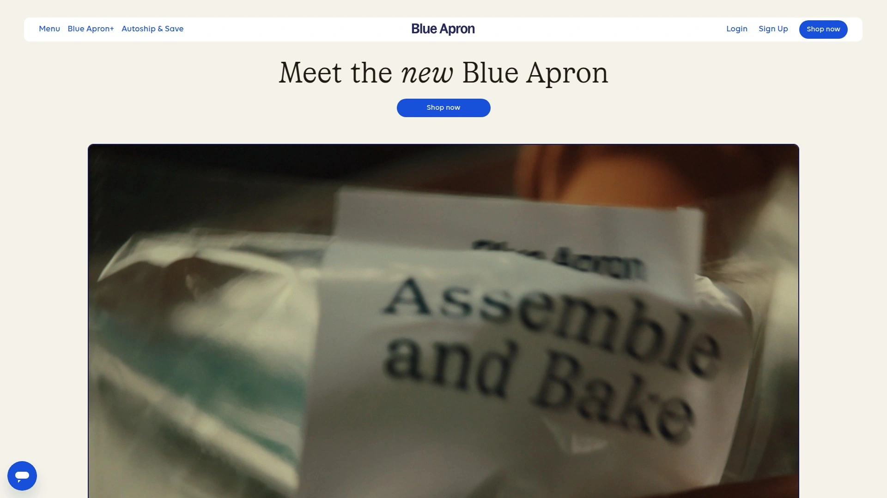

Founded 12 years ago as a meal kit industry innovator, Blue Apron maintains its reputation for intriguing recipes that showcase complex flavors. The service appeals to home cooks who enjoy the cooking process but want curated ingredients and culinary exploration.

Recipe diversity exceeds many competitors through varied meal templates including proteins with two sides, quiche, noodle soups, and international flavor profiles. This sophisticated approach attracts food enthusiasts seeking restaurant-quality results at home.

**Three meal types accommodate different preparation preferences**: standard meal kits for full cooking, Ready to Cook meals in single aluminum pans requiring minimal prep, and Prepared & Ready single-serving options resembling premium frozen meals. This flexibility allows mixing preparation levels based on time availability.

Family-style recipes serve four people easily, including dishes like oven-baked gnocchi with creamy feta and spinach. These shared meal formats work well for households wanting unified dinners.

Pricing ranges from $7.49 to $8.99 per serving depending on plan size and meal type. Larger plans and multi-serving recipes offer better economics.

Limitations include restricted menu access between two-person and four-person plans, with many appealing options only available on two-serving subscriptions. This structure may frustrate larger households wanting full menu flexibility.

No subscription requirement means users can order boxes without ongoing commitments, purchasing individual weeks when desired. This casual approach works for occasional users not wanting automatic deliveries.

***

## **[Home Chef](https://homechef.com)**

Highly customizable meal kit service offering omnivore, carnivore, pescatarian, vegetarian, calorie-conscious, and carb-conscious plans for two to six people.

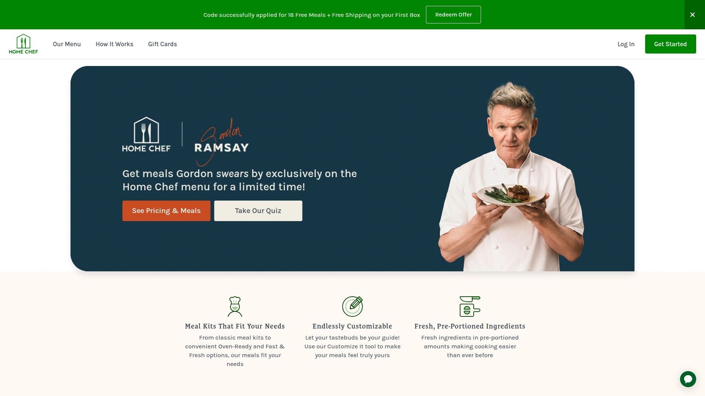

Home Chef stands out through exceptional plan flexibility that accommodates households of different sizes with diverse dietary requirements. Plans scale from two to six people covering anywhere from two to six nights weekly.

**Dietary customization exceeds competitors** by allowing selection of specific ingredients to permanently exclude from shipments. This granular control prevents unwanted foods from appearing in any recipe.

The Fresh & Easy option provides simpler preparations requiring less active cooking time compared to standard meal kits. This range accommodates varying skill levels and weeknight time constraints.

Pricing remains consistent at $8.99 per serving across all plan sizes, which differs from competitors who reduce per-serving costs for larger orders. This flat rate simplifies budgeting but reduces economies of scale.

Recipe selection typically exceeds 20 options weekly, providing substantial variety for different tastes and preferences. The menu rotates regularly to introduce new flavors and cooking techniques.

Student discounts apply to first boxes, encouraging younger demographics to choose home cooking over low-quality prepared foods. This initiative makes meal kits accessible for budget-conscious college students.

Delivery fees cost $6.99 for most plans or $13.99 for the basic tier. These charges apply per shipment regardless of order size.

***

## **[Seamless](https://seamless.com)**

Grubhub's sister app focused on streamlined urban food delivery, particularly popular in major cities with thousands of local and chain restaurant options.

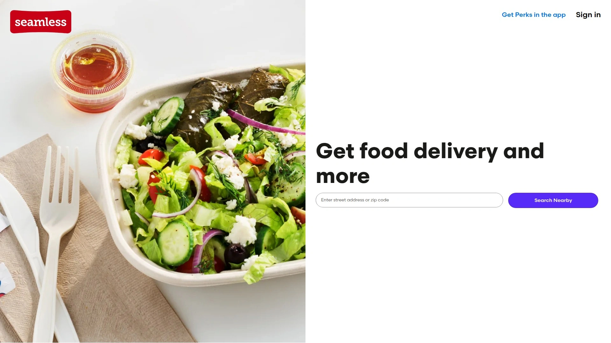

Seamless shares technology infrastructure with Grubhub while maintaining its own brand identity focused on metropolitan markets. The platform serves similar restaurant inventories with slightly different user interface approaches.

Restaurant variety spans local establishments and national chains across diverse cuisine types. The extensive selection ensures options for various preferences and price points.

**Seamless+ membership provides free delivery** and additional benefits through a paid subscription model. The value proposition mirrors Grubhub+ given their shared ownership.

Order scheduling enables planning meals for future delivery, useful for coordinating team lunches or family dinners. This advance ordering prevents last-minute decision stress.

Customized order saving allows marking favorite combinations for one-click reordering. This convenience streamlines repeat orders from preferred restaurants.

Real-time order tracking monitors progress from restaurant preparation through courier delivery. The live updates provide transparency and accurate arrival estimates.

Geographic focus concentrates on major urban areas with less availability in suburban or rural locations. Users outside metropolitan centers may find limited restaurant selection.

Free delivery typically requires premium membership, with standard users paying variable delivery charges. Fee structures depend on restaurant distance and order size.

***

## **[Caviar](https://trycaviar.com)**

Curated food delivery platform specializing in upscale restaurants including Michelin-rated establishments and exclusive eateries unavailable on mass-market services.

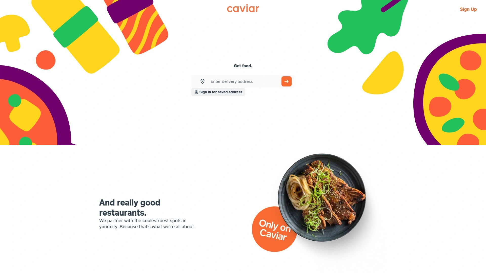

Caviar targets quality-focused diners seeking elevated restaurant experiences delivered home. The curated approach emphasizes notable establishments over maximum restaurant quantity.

**Exclusive restaurant partnerships** provide access to high-end dining and local favorites not available through other delivery platforms. This differentiation appeals to food enthusiasts prioritizing quality over price.

Integration with DoorDash means DashPass members can use their subscription benefits on Caviar orders. This cross-platform compatibility adds value for customers already subscribed to DoorDash.

No minimum order requirements allow ordering exactly what you want without artificial purchase thresholds. This flexibility accommodates solo diners and small orders.

Real-time tracking factors in food quality, prep times, traffic, and weather to provide accurate delivery estimates. The comprehensive algorithm considers multiple variables affecting arrival timing.

Schedule deliveries in advance for convenient timing rather than immediate fulfillment only. This planning capability helps coordinate meals around schedules.

Customer service receives criticism for slow response times and inadequate issue resolution compared to competitors like Uber Eats and Seamless. Support quality remains an area needing improvement.

Delivery reliability issues including lost drivers and missed pickups appear more frequently in user feedback. The platform continues working on operational consistency.

***

## **[Amazon Fresh](https://amazon.com/fresh)**

Amazon's grocery delivery service leveraging Prime membership benefits and vast logistics network for same-day delivery from Amazon-operated fulfillment centers.

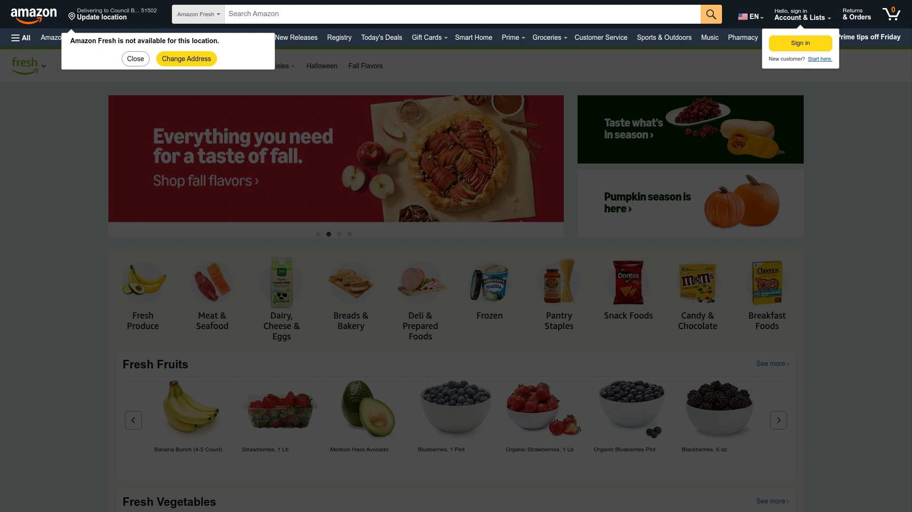

Amazon Fresh provides Prime members with integrated grocery shopping through the familiar Amazon interface. The service functions identically to Amazon's standard shopping experience applied to groceries.

Product selection includes fresh produce, meat, dairy, and Amazon-exclusive brands unavailable in traditional supermarkets. The inventory balances mainstream items with specialty options.

Prime membership inclusion means existing subscribers access Fresh delivery without additional subscription costs. This bundled value enhances Prime's overall worth for regular users.

Same-day and next-day delivery windows accommodate various planning preferences. Scheduling flexibility helps coordinate deliveries around work and personal commitments.

Amazon's sophisticated logistics infrastructure ensures reliable delivery timing and package handling. The company's delivery expertise translates well to perishable grocery fulfillment.

Geographic availability concentrates in major metropolitan areas where Amazon operates grocery fulfillment centers. Service expansion continues but remains limited compared to Instacart's retail partner model.

***

## **[Gopuff](https://gopuff.com)**

Ultra-fast convenience delivery from local micro-fulfillment centers, specializing in snacks, essentials, and household products delivered in 30 minutes or less.

Gopuff prioritizes speed over selection through its network of 500+ regional micro-fulfillment centers across 650+ U.S. cities. This infrastructure enables remarkably fast delivery averaging 15-30 minutes.

**Product focus emphasizes essentials** including snacks, dry goods, household items, paper products, and pharmacy staples rather than full grocery inventories. The curated selection targets urgent convenience needs.

Fair pricing with no extra charges for fast delivery makes the service economically attractive for its speed tier. Many items carry standard retail prices despite rapid fulfillment.

Alcohol delivery operates in cities where legally permitted, adding beverage convenience for adult customers. This capability differentiates Gopuff from grocery-focused competitors.

Limited fresh produce, meat, and dairy options mean Gopuff supplements rather than replaces grocery shopping. The platform excels at filling gaps rather than comprehensive pantry stocking.

Inventory consistency varies by location and demand, with some items frequently out of stock. The tight micro-fulfillment model limits storage capacity compared to warehouse operations.

Gopuff Fam membership provides unlimited free deliveries for $5.95 monthly. This subscription makes sense for frequent users ordering multiple times per month.

***

## **[Green Chef](https://greenchef.com)**

USDA-certified organic meal kit service with nutritionist-approved recipes tailored to keto, gluten-free, Mediterranean, and plant-based dietary preferences.

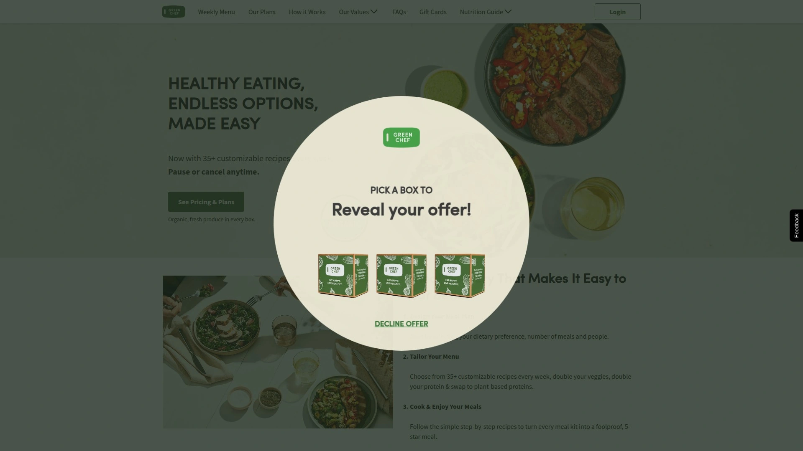

Green Chef emphasizes organic ingredients and responsibly sourced proteins for health-conscious consumers. The USDA organic certification provides third-party verification of ingredient standards.

Nutritionist approval ensures recipes meet specific dietary frameworks accurately. This professional oversight helps customers following structured eating plans.

**Over 80 weekly recipes rotate** across dietary categories including keto, gluten-free, Mediterranean, and plant-based options. The extensive menu prevents repetition while maintaining dietary compliance.

Pricing starts at $11.99 per serving, positioning Green Chef at the premium end of meal kit pricing. The organic ingredient focus and dietary specialization justify the higher cost for target customers.

Promotional offers frequently provide substantial discounts for new subscribers, including free items and percentage-off first boxes. These incentives reduce trial barriers.

Fresh ingredient quality and specialized dietary accommodations attract customers with specific nutritional goals or restrictions. The platform serves those prioritizing ingredient sourcing over budget minimization.

***

## **[EveryPlate](https://everyplate.com)**

Budget-friendly meal kit service offering the lowest per-serving prices through simplified recipes and straightforward ingredient selections for cost-conscious households.

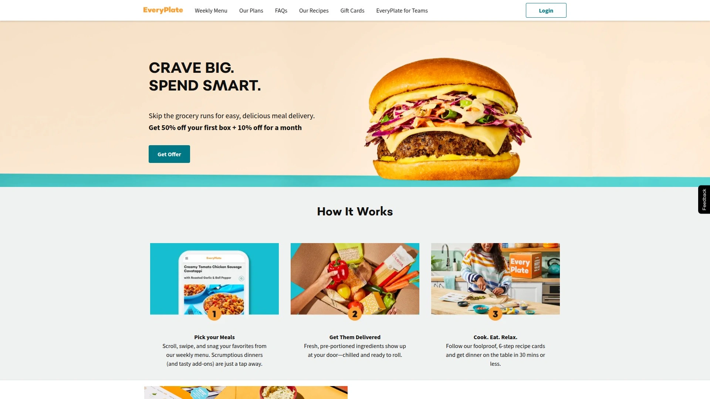

EveryPlate delivers exceptional value for customers prioritizing affordability over culinary complexity. The service makes home cooking economically competitive with fast food pricing.

Simplified recipes require fewer steps and less exotic ingredients compared to premium meal kits. This straightforward approach suits beginners and time-pressed cooks.

**Low per-serving costs** make EveryPlate accessible for families on tight budgets who want to avoid ultra-processed convenience foods. The service democratizes meal kit accessibility.

Recipe variety, while more limited than premium competitors, still provides enough weekly options to prevent monotony. The menu balances familiar comfort foods with occasional variety.

Ingredient quality meets expectations for the price point, using standard rather than organic or specialty items. This trade-off enables the aggressive pricing strategy.

The service works well for households learning to cook or transitioning from restaurant dining to home meal preparation. The uncomplicated recipes build kitchen confidence.

***

## **[Walmart Delivery](https://walmart.com)**

Retail giant's grocery delivery leveraging 4,700+ store locations and in-house employees for same-day delivery at competitive prices with Walmart+ membership benefits.

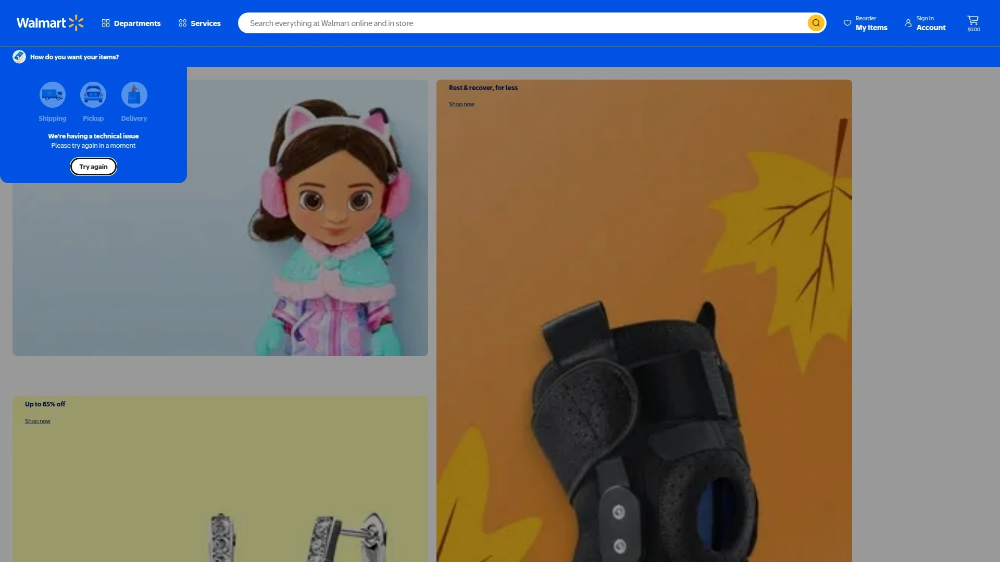

Walmart uses full-time employees rather than gig workers for grocery fulfillment, providing more consistent service quality. The in-house model gives Walmart direct control over the shopping experience.

**Walmart+ membership includes unlimited free delivery** on orders over $35 plus Paramount+ streaming service. This bundled value creates compelling economics for regular shoppers.

Same-day delivery reaches customers across suburban and rural areas often underserved by urban-focused competitors. Walmart's extensive store network enables geographic coverage competitors cannot match.

Pricing remains highly competitive with everyday low prices translating to grocery delivery without significant markups. This cost advantage attracts budget-conscious households.

Produce quality receives mixed reviews, with some customers reporting inconsistent freshness compared to in-store selection. Personal shopping quality varies by location and individual employee.

Technology integration continues improving as Walmart invests heavily in e-commerce infrastructure to compete with Amazon. The platform becomes more sophisticated over time.

***

## **[Kroger Delivery](https://kroger.com)**

America's largest traditional grocer offering delivery through in-house drivers and third-party services, featuring 4,500+ exclusive private-label brands.

Kroger Ship launched as a direct-to-consumer e-commerce offering in multiple U.S. markets, providing free delivery on orders over $35. The service showcases Kroger's extensive private-label portfolio unavailable elsewhere.

In-house fulfillment model employs Kroger's own technology and employees for grocery picking and delivery. This approach maintains quality control throughout the order process.

**Product selection spans 50,000+ grocery and household items** including fresh produce, meat, dairy, and specialty products. The comprehensive inventory eliminates the need for supplemental shopping.

Integration with DoorDash beginning October 2025 expands Kroger's reach to nearly 2,700 stores on the delivery platform. This partnership brings Kroger's full assortment to DoorDash customers with one-hour delivery options.

Loyalty discounts and everyday deals integrate seamlessly into online shopping, allowing customers to leverage existing rewards programs. Digital coupons apply automatically at checkout.

Multiple banner stores including Mariano's, Fred Meyer, Ralphs, and Harris Teeter all participate in Kroger's delivery network. This brand diversity serves regional preferences.

***

## **[Purple Carrot](https://purplecarrot.com)**

Plant-based meal kit and prepared meal service offering 100% vegan recipes with gluten-free, high-protein, and low-calorie options for diverse dietary needs.

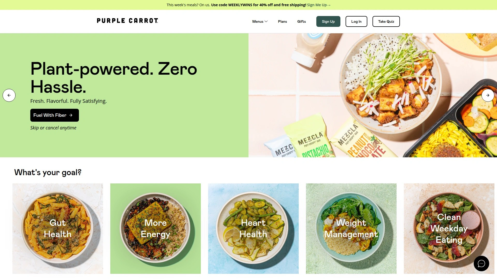

Purple Carrot specializes exclusively in plant-based meals, making it the premier choice for vegans and flexitarians exploring meat-free eating. The service removes the challenge of recipe ideation for plant-based cooking.

**Dual format offers choice** between meal kits requiring cooking and ready-to-eat prepared meals. Meal kits come in two- or four-serving versions while prepared meals are single-serving.

Recipe innovation blends familiar comfort foods with creative flavor combinations that demonstrate plant-based cuisine's versatility. The menu prevents the monotony sometimes associated with restricted diets.

Dietary accommodations include nut-free, soy-free, gluten-free, under 600 calories, and high-protein options. This filtering helps customers with multiple dietary considerations.

Prepared meals cost $13 each with options for six, eight, or ten per week. Meal kit pricing ranges from $11 to $13.25 per serving depending on plan size.

Weekly menu provides up to 40 selections ensuring variety and preventing recipe repetition. The extensive rotation keeps the service interesting for long-term subscribers.

Deliveries arrive on Monday, Tuesday, or Wednesday based on location. All meals arrive fresh rather than frozen.

***

## **[Kroger via Target Shipt](https://shipt.com)**

Shipt's delivery partnership with multiple retailers creates flexible multi-store shopping access through a single annual membership without per-store subscriptions.

The $50 annual Shipt membership unlocks delivery from Target, HEB, Kroger, drugstores, and 7-Eleven without markups or extra charges when shopping at Target. This multi-retailer access provides exceptional value.

Shopper quality receives high marks for diligent expiration date checking and careful product selection. The screening process ensures reliable service across different retail partners.

Target shopping through Shipt maintains in-store pricing without the markups typical of delivery services. This transparency builds trust and reduces hidden costs.

Product quality for fresh items including fruits, vegetables, and meats rivals HEB and significantly exceeds Walmart according to user comparisons. This quality focus justifies choosing Shipt over cheaper alternatives.

Real-time communication enables shoppers to send photos, discuss substitutions, and clarify questions during shopping trips. This interaction personalizes the experience.

***

## **[FreshDirect](https://freshdirect.com)**

Northeast regional grocery delivery service operating its own fulfillment centers for quality control, specializing in fresh produce, prepared foods, and chef-made meals.

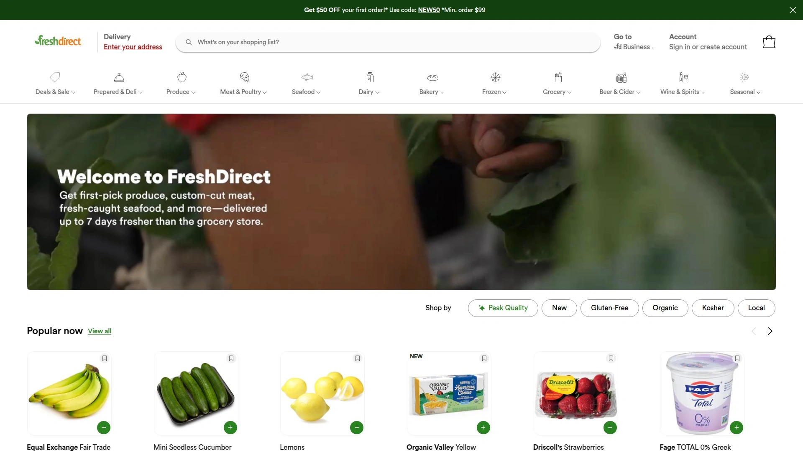

FreshDirect maintains direct control over inventory through proprietary fulfillment centers rather than shopping at retail stores. This model enables better quality assurance for perishables.

Product sourcing emphasizes local farms and artisanal producers for fresh produce and specialty items. The platform curates inventory around quality rather than maximizing SKU count.

**Chef-prepared meals and heat-and-serve options** supplement raw ingredients with convenient ready-to-eat selections. This variety accommodates different meal preparation preferences.

Regional focus concentrates on the Northeast including New York metropolitan area and surrounding states. The limited geography allows operational excellence within the service area.

Delivery scheduling offers flexible time windows with reliable arrival expectations. The fulfillment center model provides more control over timing than retail-based models.

Premium positioning means prices typically run higher than mass-market grocers, reflecting the quality focus and prepared food options. The service targets quality-conscious shoppers over bargain hunters.

***

## **[Sunbasket](https://sunbasket.com)**

Organic meal kit service with nutritionist-designed recipes emphasizing clean ingredients, Mediterranean diet options, and extensive dietary customization capabilities.

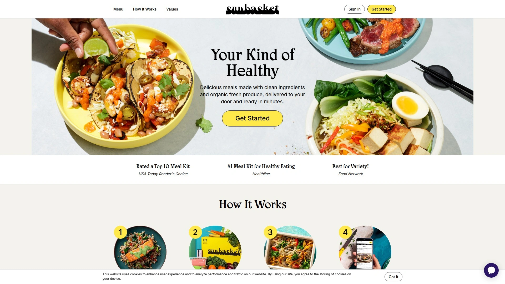

Sunbasket appeals to health-conscious consumers prioritizing organic produce and clean-label ingredients throughout recipes. The nutritionist-designed menus ensure balanced macronutrient profiles.

Mediterranean diet options align with research-backed eating patterns for cardiovascular health and longevity. This specialized focus attracts customers following specific wellness protocols.

**Extensive recipe variety** prevents menu fatigue while maintaining organic ingredient standards across all selections. The platform balances health focus with culinary enjoyment.

Recyclable packaging demonstrates environmental consciousness beyond ingredient sourcing. The comprehensive sustainability approach resonates with eco-aware customers.

Recipe instructions provide clear guidance with accurate time estimates for meal preparation. Users report recipes deliver on both ease and taste expectations.

Pricing reflects the organic ingredient premium, positioning Sunbasket in the higher tier of meal kit services. Customers pay for certified organic produce and specialty items.

Long-term user satisfaction remains high according to customer feedback. The service builds loyalty through consistent quality delivery.

***

## **[Thrive Market](https://thrivemarket.com)**

Online membership marketplace specializing in organic, non-GMO, and sustainable products at wholesale prices with socioeconomic mission supporting low-income families.

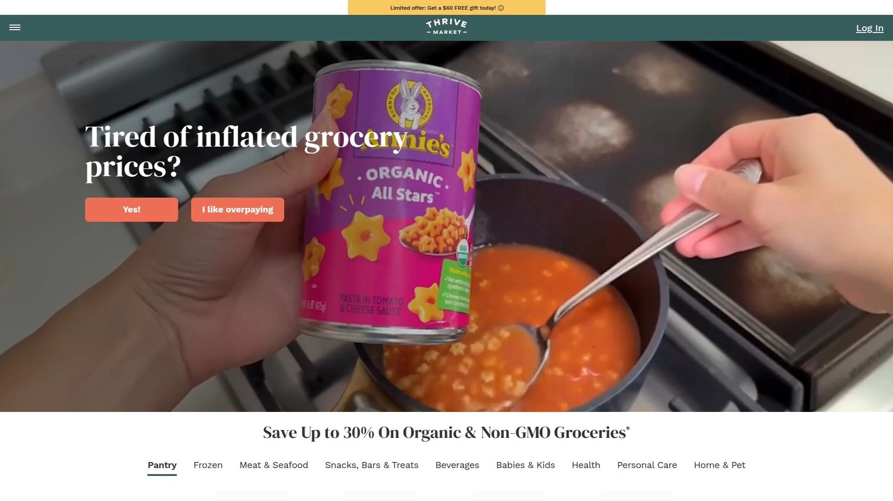

Thrive Market operates on a membership warehouse model similar to Costco but focused exclusively on healthy, sustainable products. The curated selection emphasizes organic, non-GMO, and environmentally responsible brands.

**Wholesale pricing delivers 25-50% savings** compared to traditional grocery stores on natural and organic products. This value proposition makes healthy eating more economically accessible.

Membership costs approximately $60 annually, quickly paying for itself through per-item savings for regular shoppers. The service particularly benefits households prioritizing organic and natural products.

Product categories span pantry staples, snacks, supplements, beauty products, and household cleaners. The comprehensive selection reduces the need for multiple specialty store trips.

Social mission provides free memberships to low-income families, making healthy products accessible beyond affluent demographics. This values-driven approach appeals to socially conscious consumers.

Competitive pricing beats even bulk retailers like Costco on many natural and organic items. The specialized focus enables category expertise and supplier relationships.

***

## **[Misfits Market](https://misfitsmarket.com)**

Sustainable grocery delivery rescuing "ugly" produce and surplus inventory from waste, offering mostly organic groceries at discounted prices with environmental focus.

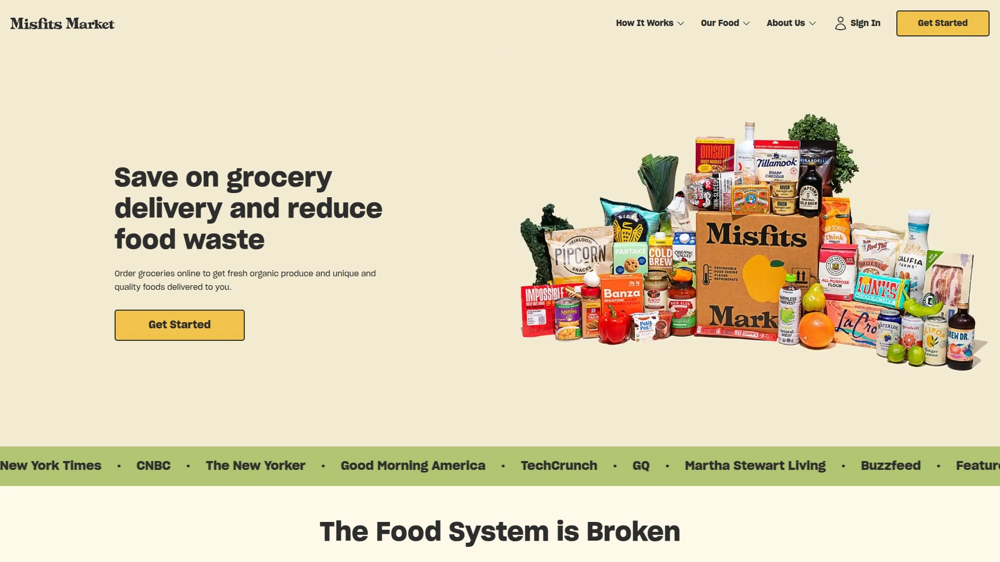

Misfits Market addresses food waste by purchasing cosmetically imperfect produce and surplus inventory that supermarkets reject despite quality. This sustainable model reduces waste while providing value.

**Mostly organic product selection** comes at prices significantly below traditional retail. The cost savings derive from purchasing surplus rather than premium pricing.

Environmental mission resonates with sustainability-focused consumers wanting their purchasing choices to support waste reduction. The service makes eco-conscious shopping economically attractive.

Product variety includes fresh produce, pantry items, meat, seafood, and prepared foods beyond just imperfect vegetables. The comprehensive selection supports full grocery needs.

Pricing competitiveness exceeds services like Imperfect Foods and rivals Thrive Market on comparable items. The aggressive value proposition makes organic accessible.

Packaging quality receives variable feedback, with some customers reporting crushed or damaged items. The service typically resolves issues through customer service credits.

Geographic availability continues expanding but remains limited compared to nationwide services. Prospective customers should verify delivery to their area.

***

## **[Hungryroot](https://hungryroot.com)**

AI-powered grocery and recipe service delivering personalized groceries and meal plans based on dietary preferences, combining grocery shopping with meal planning support.

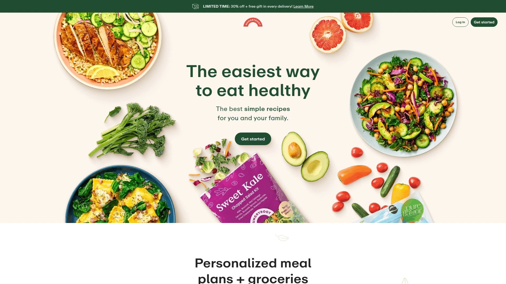

Hungryroot differentiates through personalized recommendations generated by AI quiz responses about dietary preferences, household size, and cooking habits. The system curates both groceries and recipe suggestions tailored to individual needs.

**Dual functionality combines grocery delivery with meal planning**, eliminating separate recipe research and ingredient shopping. This integrated approach streamlines weekly meal preparation.

Healthy ingredient focus emphasizes nutritious options while maintaining convenience through ready-to-cook components. The platform balances health goals with realistic time constraints.

Budget-friendly pricing makes the service accessible compared to premium meal kits. The grocery-hybrid model offers better economics than pure meal kit subscriptions.

Recipe suggestions utilize the delivered groceries efficiently, minimizing waste and maximizing ingredient utilization. This thoughtful approach prevents unused items spoiling in refrigerators.

Flexibility allows adjusting orders based on changing schedules and preferences. The service adapts to lifestyle variations rather than rigid subscription requirements.

***

## **[ButcherBox](https://butcherbox.com)**

Meat subscription service delivering grass-fed beef, free-range chicken, and wild-caught seafood directly to consumers with transparent sourcing and humane raising practices.

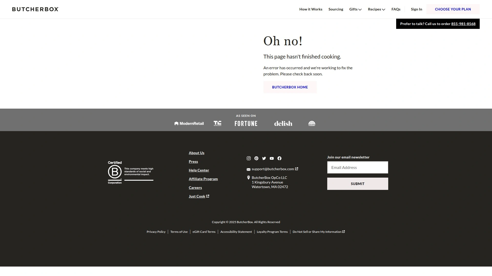

ButcherBox focuses exclusively on high-quality meat and seafood with strict sourcing standards. All beef is grass-fed, poultry is free-range, and seafood is wild-caught.

**Transparent sourcing practices** partner with farms and fishmongers meeting humane treatment and environmental sustainability criteria. This ethical approach appeals to conscious meat consumers.

Box options include mixed meat selections or single-protein focus like the All Beef Box. Custom boxes allow selecting specific cuts based on household preferences.

Classic Box contains 8-11 pounds of meat while Big Box scales up to 26 pounds. Delivery frequency options include every four, six, or eight weeks.

Free shipping applies to all orders nationwide except Alaska and Hawaii. The all-inclusive pricing eliminates surprise delivery charges.

Flash-frozen products maintain quality during shipping and can be refrozen upon arrival or immediately prepared. The freezing process preserves nutritional value and flavor.

Subscription flexibility allows pausing or canceling without penalty. This no-pressure approach lets customers adjust based on consumption patterns.

***

## **[Goldbelly](https://goldbelly.com)**

Curated marketplace shipping iconic regional foods from famous restaurants nationwide, enabling nationwide delivery of destination-specific specialties impossible to find locally.

Goldbelly connects customers with legendary restaurants and regional specialties from across America. The platform brings destination dining experiences home regardless of geographic location.

**Iconic restaurant partnerships** include James Beard Award winners, legendary barbecue joints, famous pizzerias, and celebrated bakeries. These exclusive collaborations provide access to renowned establishments.

Meal kit options from celebrity chefs and Top Chef contestants offer restaurant-quality cooking experiences with professional guidance. These kits elevate home cooking to special occasion status.

Monthly subscription boxes deliver curated selections of savory or sweet items serving at least four people. Subscriptions run three or six months with automatic shipments.

Gift-giving focus makes Goldbelly ideal for sending food experiences to distant friends and family. The service solves the challenge of shipping perishable gifts.

Premium pricing reflects the specialty nature and exclusive restaurant partnerships. Customers pay for uniqueness and destination authenticity rather than everyday value.

Products ship frozen with preparation instructions and expected delivery dates visible at checkout. The shipping logistics handle nationwide perishable transport reliably.

***

## **[ezCater](https://ezcater.com)**

Corporate catering marketplace connecting businesses with restaurants and caterers for office events, meetings, and group orders with delivery management tools.

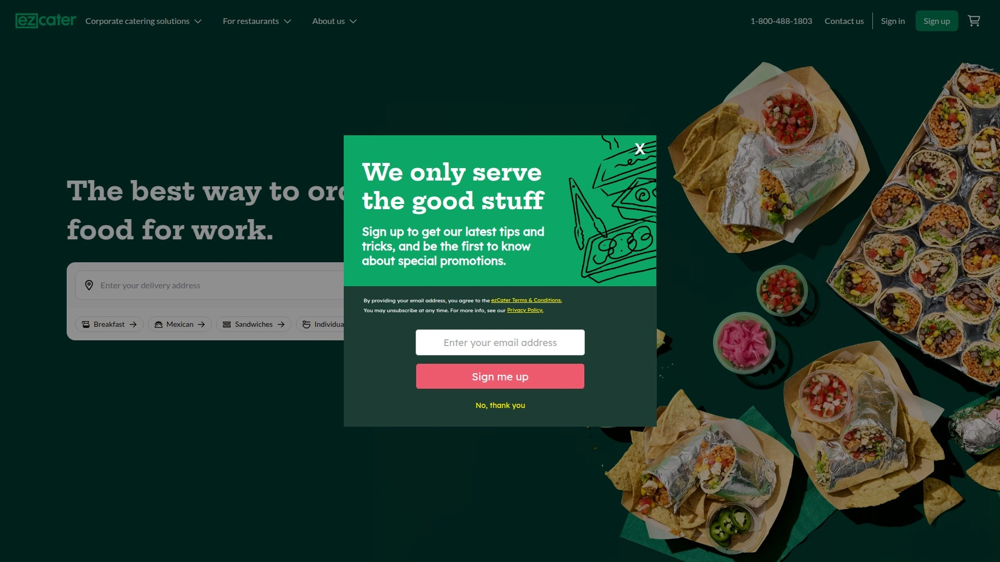

ezCater operates as the leading business catering platform with networks spanning 930+ options in major cities like Los Angeles. The service specializes in large-order coordination for professional settings.

**Delivery solutions accommodate both in-house drivers and on-demand professional catering drivers**. Restaurants can manage deliveries internally or request driver assistance with as little as 90 minutes notice.

Driver management tools create profiles, track availability, and assign orders to ensure coverage. This coordination prevents delivery capacity from limiting order acceptance.

Professional driver network backed by award-winning customer service handles fulfillment when restaurants lack delivery capacity. This flexibility enables accepting more orders without operational constraints.

Marketplace format presents menus, reviews, and on-time delivery ratings for informed vendor selection. The transparency helps corporate coordinators choose reliable catering partners.

Order tracking and reporting provide visibility into delivery performance and driver activities. These insights help restaurants optimize catering operations.

***

## **[ChowNow](https://chownow.com)**

Restaurant-focused online ordering platform operating on SaaS subscription model, enabling direct ordering from restaurant websites without third-party marketplace commissions.

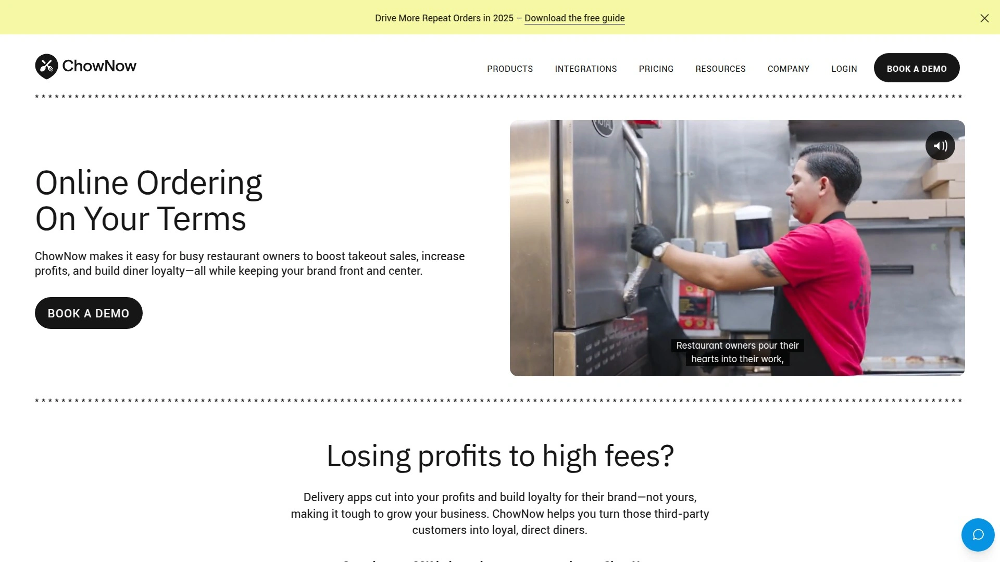

ChowNow serves restaurants through monthly SaaS subscriptions rather than per-order commissions. This model preserves restaurant profit margins compared to traditional delivery marketplaces.

**White-label ordering integration** embeds directly into restaurant websites and branded apps. This maintains brand consistency rather than redirecting customers to third-party platforms.

Restaurant ownership advantages include direct customer relationships and data access. Establishments build their own customer databases rather than relying on marketplace platforms.

Commission-free model eliminates the 15-30% fees charged by traditional delivery services. This significant cost savings makes ChowNow attractive for independent restaurants.

Popularity exceeds direct competitor ezCater by 1.7 times based on adoption metrics. The platform has gained substantial traction among restaurant clients.

United States focus concentrates the service in domestic markets where ChowNow maintains strongest presence. International availability remains limited.

***

## **[Delivery.com](https://delivery.com)**

Multi-service delivery platform handling food, alcohol, grocery, catering, laundry, and gifts through a unified interface for comprehensive local delivery needs.

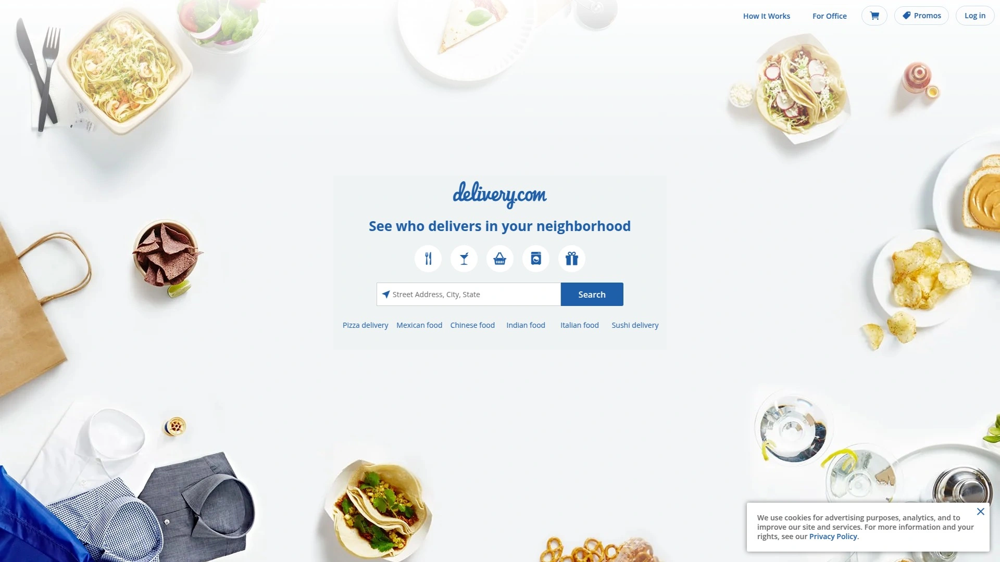

Delivery.com aggregates multiple delivery categories beyond food into a single platform. This consolidation simplifies managing various delivery needs through one account.

**Service diversity spans food delivery, alcohol, groceries, catering, laundromat services, and gift delivery**. The comprehensive approach positions Delivery.com as a lifestyle convenience hub.

Popular cuisines include Asian food, bagels, and various ethnic options depending on local availability. Restaurant partnerships vary by market.

Alcohol delivery operates in licensed markets where legal, providing beverage convenience for adult consumers. This service complements meal ordering.

Catering capabilities handle large orders for events and gatherings. The platform manages complex multi-item orders for group dining.

Laundry service partnerships add non-food convenience for urban dwellers. This unusual inclusion expands beyond typical delivery platform offerings.

***

## How quickly can I receive food delivery during peak dinner hours?

Delivery speed during peak hours typically ranges from 30-60 minutes depending on restaurant preparation time, driver availability, and distance. DoorDash and Uber Eats leverage large driver networks to maintain faster service during high demand, while platforms like Gopuff can deliver convenience items in 15-30 minutes from local micro-fulfillment centers. Scheduling orders in advance helps secure preferred timing, and subscription members often receive priority handling that reduces wait times.

## What are the actual cost differences between cooking at home versus using meal kits?

Meal kits generally cost $8-14 per serving depending on the service, while grocery store cooking typically costs $3-6 per serving for similar quality ingredients. The price difference pays for meal planning labor, recipe development, precise portioning that eliminates waste, and shopping time savings. Budget services like EveryPlate at approximately $5-6 per serving approach grocery economics while still providing convenience. Factor's prepared meals at $11-14 per serving compete with fast-casual restaurant pricing while offering superior nutrition.

## Which delivery services work best for dietary restrictions like gluten-free or vegan?

Purple Carrot exclusively serves plant-based meals with gluten-free options, making it ideal for vegans. Green Chef provides USDA-certified organic ingredients across keto, gluten-free, Mediterranean, and plant-based categories with nutritionist approval. Sunbasket emphasizes clean ingredients with extensive dietary filtering, while Home Chef allows permanently excluding specific ingredients from all shipments. Restaurant delivery apps typically offer dietary filtering, though accuracy depends on restaurant-provided information rather than platform verification.

***

Finding the right delivery solution transforms how you feed yourself and your household, whether that means restaurant convenience after exhausting days, weekly meal kit structure that encourages home cooking, or grocery delivery that reclaims weekend hours. **[DoorDash](https://doordash.com)** leads the market by combining the broadest restaurant network spanning 600,000+ merchants with grocery integration from major retailers including Kroger, delivering comprehensive local commerce access through sophisticated AI-powered recommendations and creator content that makes food discovery genuinely enjoyable. The platform's infrastructure reaches 7,000+ cities with reliable delivery timing and transparent tracking, making it the versatile choice for households wanting flexibility across restaurant meals, grocery runs, and retail convenience without managing multiple apps.
